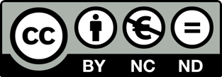

## About this manual

Document management has always been the main task of libraries. With the beginning of the digitisation of information, the task has changed dramatically. Metadata is increasingly used to find, sort and evaluate information. The bound book as a unit of information is increasingly divided into a multitude of smaller units (structures/document structures) in order to be able to present them in a meaningful and usable way on the Internet. In order to be able to implement these functionalities, different data formats have been developed over the past years, which store the necessary meta-information for a document and refer to the actual content (e.g. TIFF, XML or HTML files). It is also common practice to aggregate metadata to a document from different sources and to add to it if necessary.

For software development, this results in some special features. Since data formats change or are extended quickly and different projects have different requirements for data formats (different data must be stored), it is advisable to use a data format that is as flexible and well-defined as possible. To be able to process different formats, it is also advisable that all tools and programs are based on a uniform programming interface (API).

The UGH library represents such a programming interface, which can and should be used by different tools and programs to load and save data. This interface implements a universal document model, which is independent of underlying formats for describing meta information. Instead, there are different classes for serializing a document. Each of these classes implements exactly one data format. Superior program layers (e.g. the business logic) are therefore completely independent of the data format. Note, however, that not all data formats can always implement the complete universal document model. Similarly, some serialization classes can only read data, since writing is not required for this data format or does not seem to make much sense. This applies, for example, to classes that transfer data formats from library catalogs. Since only the bibliographic level is usually represented there, all structure information and references could not be written. For this reason, a write method was not used for these classes.

The source code of UGH can be found on GitHub.

[https://github.com/intranda/ugh](https://github.com/intranda/ugh)

## Contact

If you have any questions about this documentation, suggestions for the further development of this manual or general questions about Goobi, digitisation projects in general and, of course, the further development of Goobi, please do not hesitate to contact intranda GmbH:

| **Contact** |  |
| :--- | :--- |
| Address: | intranda GmbH, Bertha-von-Suttner Str. 9, D-37085 Göttingen |
| Phone: | +49 551 291 76 100 |
| Email: | [info@intranda.com](mailto:info@intranda.com) |
| URL: | [https://www.intranda.com](https://www.intranda.com) |

## Copyright

Please note that this documentation may not be modified or passed on in modified form. Commercial use of this documentation is not permitted.

 

This work is licensed under the Creative Commons Attribution-Non Commercial-No Derivatives 4.0 International License. To view a copy of this license, visit [http://creativecommons.org/licenses/by-ncnd/4.0/](http://creativecommons.org/licenses/by-ncnd/4.0/) or send a letter to Creative Commons, PO Box 1866, Mountain View, CA 94042, USA.

